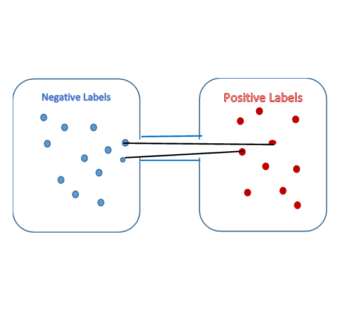

## Introduction  
In mathematics, **spectral graph theory** is the study of the properties of a graph in relationship to the characteristic polynomial, eigenvalues and eigenvectors of matrices associated with the graph, such as its adjacency matrix or Laplacian matrix.  A **spectrum** of the graph is defined as eigenvectors of a graph ordered by the magnitude of their corresponding eigenvalues.  
Whether to express a graph as an adjacency matrix of Laplacian matrix depends on the motivation or information that needs to be extracted from the graph. If the information required is number of walks of any length _n_ between one vertex and another we use the adjacency matrix to express the graph. If the motivation is to perform graph partitioning, Laplacian matrix is used. In this article we shall focus on undirected graphs.

## 1. Adjacency Matrix  
In graph theory , an adjacency matrix is a square matrix whose rows and columns represent vertices of finite graph. The elements of the matrix indicate whether pairs of vertices are adjacent or not in the graph. If the pairs are adjacent, the corresponding entry of the matrix is 1 and 0 otherwise. 
Let A represent an n x n adjacency matrix  of a graph with n nodes, then:  
$$ A^k (u,v) $$ = number of walks of length k from u to v  
### 1.1. Intuition behind eigenvectors of Adjacency matrix
Before delving further, let us try to get an intuition of what eigenvalues of an adjacency matrix are:   
A vector x of a graph G provides the values of the labels of each vertex. This implies that Ax calculates the sum of the values of the labels of the vertices that are adjacent to each vertex i.e.  
 $$ \displaystyle Ax=\sum_{i=1}^n x_i $$  
   
By definition, if x is an eigenvector of matrix A:  
$$  \displaystyle Ax=\lambda x  $$
  
Thus, an eigenvector of matrix A represents the value of labels of all vertices of a graph such that the sum of the values of the labels of the vertices that are adjacent to each vertex is a multiple of the value of the label of the vertex itself.  
For an undirected graph the matrix A is symmetric and therefore has real and orthogonal eigenvectors.   
### 1.2. Representing adjacency matrix in terms of its eigenvectors and eigenvalues
Let X be matrix of all eigenvectors of adjacency matrix A, then by definition:    

$$ AX=X\Lambda $$, where $$ \Lambda $$ is a diagonal matrix with eigenvalues of A as its diagonal elements for corresponding eigenvectors in X. 
  
Multiplying both sides with  $$ X^{-1} $$      
$$ \displaystyle A=X\Lambda X^{-1} $$    
$$ \displaystyle A=\sum_{i=1}^n λ_i  X_i X_i^{-1}=\sum_{i=1}^n \lambda_i  X_i X_i^{-T} $$ (since X is an orthogonal matrix )      
Let $$  \displaystyle P_i=X_i X_i^{-T} $$      
$$ \displaystyle A=\sum_{i=1}^n λ_i  P_i $$ 

We can see that an adjacency matrix can be written as the summation of the product of its eigenvalues with dot product of corresponding eigenvectors with themselves.
Also, it can be shown that any function applied to matrix A is equivalent applying the function on the eigenvalues multiplied by the projection matrix    
  
$$ \displaystyle f(A)= \sum_{i=1}^n f(\lambda_i) P_i $$  
		
### 1.3. Properties of adjacency matrices 
Once we know how adjacency matrix can be written as in terms of its eigenvalues and eigenvectors, we can see that      
$$ Tr(A^k )=\sum_{i=i}^n \lambda_i^k $$
  
As $$ A^k (u,v) $$ = number of walks of length k from u to v, it implies:
<ul>
  
<li> $$  \displaystyle Tr(A)=\sum_{i=1}^n \lambda_i =0   $$  </li>      
<li> $$  \displaystyle Tr(A^2 )=\sum_{i=1}^n \lambda_i^2 $$ = 2* number. of edges in G  </li>  
<li> $$  \displaystyle Tr(A^3 )=\sum_{i=1}^n \lambda_i^3 $$ = number of triangles in G  </li>  
</ul>
<a/>  

## 2. Laplacian Matrix  
A graph is represented as a Laplacian matrix when the motivation is to partition the graph. Partitioning the graph involves dividing the graph to two pieces such that the resulting pieces have low conductance. Conductance that be intuitively understood as a measure to define how well connected a subset of a graph is with rest of the graph. Low conductance means that the subset is not well connected with the rest of the graph.  
  
A Laplacian matrix L of a graph G with n nodes is an n x n matrix defined as:    
$$ L = D – A $$  
  
where D is the degree matrix of graph G and A its adjacency matrix.  
  
A degree matrix D of a graph G with n nodes is a n x n diagonal matrix with the diagonals representing the degree of each node. Thus matrix L has its diagonal as the degree of the corresponding node. Every other entry of the matrix is either 0 or -1; 0 if there is no edge between the nodes represented by the row and column of the matrix and -1 if an edge exists.  
  
Eigenvalues and eigenvectors of a graph represented as a Laplacian matrix can be used to efficiently perform graph partitioning. 
### 2.1. Properties of Laplacian matrix  
1. A trivial eigenvector of the matrix L is $$ x_1=[1,…,1] $$ which makes $$ Lx_1=0 $$ which implies that $$ \lambda_1 = 0. $$  
2. As Laplacian matrix is positive-semidefinite it  has non-negative eigenvectors  
3. As Laplacian matrix is symmetric, it has real and orthonormal eigenvectors    
   - An eigenvector x is orthogonal to the trivial eigenvector $$ x_1. x =\sum_{i=1}.x_i = \sum_i x_i = 0 $$        
   - $$  \sum_i x_i ^2=1 $$   
   - As Laplacian matrix is symmetric, $$  \displaystyle λ_2= min_x  \frac{ x^T Lx }{x^T x} $$   ⁡ 

<a/>  
### 2.2. Intuition behind the second eigenvector and eigenvalue of Laplacian matrix  
To gain an intuition of how the second eigenvector and eigenvalue of Laplacian matrix plays a role in efficient graph partitioning, let us understand what $$ x^T Lx $$ signifies  
$$  \displaystyle x^T Lx= \sum_{i,j=1}^n L_{ij} x_i x_j = \sum_{i,j=1} ^n (D_{ij}-A_{ij})x_i x_j $$    
$$ \displaystyle = \sum_{i=1}^n D_{ii} x_i^2  - \sum_{i,j \in E}^n 2 x_i x_j $$  
$$ \displaystyle = \sum_{i,j \in E}^n x_i^2 + x_j^2  - \sum_{i,j \in E}^ n2 x_i x_j $$    
$$ \displaystyle = \sum_{i,j \in E }^n (x_i-x_j)^2  $$  
  
Hence, we see that $$ \displaystyle x^T Lx $$ is just the sum of the squared distance between all edges of a graph.  
We have noted that the second highest eigenvector of L is:  
$$ \displaystyle \lambda_2=min_x  \frac{x^T Lx} {x^T x }  $$⁡   
Since x is an eigenvector, $$ x^T x=1 $$ . The above equation can therefore be written as:   
$$  \displaystyle \lambda_2=min⁡ \sum_{i,j \in E}^n (x_i - x_j)^2 $$        
From the properties of the Laplacian matrix defined above, we know that $$ \sum_i x_i = 0 $$. This implies that some of the nodes of the graph in an eigenvectors are labeled as positive and others as negative to make their summation equal to 0. 

     
  Figure 1. Graph Partitioning

 

It can be seen that $$ \lambda_2 $$ is minimized when the edges are between either the negative labeled nodes or between the positive labeled nodes whereas the edges between the positive and the negative labeled nodes are the ones that contribute maximum to the increase in the value of $$ \lambda_2 $$. Therefore, it can be seen that the eigenvector $$ x_2 $$  corresponding to$$ \lambda_2 $$ labels the nodes of a graph such that edges between nodes with positive labels and negative labels is minimized, effectively portioning  the graph into two clusters with lowest conductance possible between the two clusters.  The vector $$ x_2 $$   is called **Fiedler vector**.  
With this understanding we can define algorithms to partition a graph into two or multiple clusters    
### 2.3. Algorithm – Spectral Partitioning  
1. Compute the Laplacian matrix L for the graph
2. Compute the second largest eigenvalue $$ \lambda_2 $$  and corresponding eigenvector $$ x_2 $$ of L
3. Classify the nodes corresponding to positive values in $$ x_2 $$ into one partition and negative values into another.  
  
### 2.4. Algorithm – K-Way Spectral Clustering      
1. Compute the Laplacian matrix L  for the graph      
2. Compute the second largest eigenvalues $$ (\lambda_2  ,…,\lambda_n) $$ and corresponding eigenvectors $$ (x_2  ,…,x_n) $$ of L      
3. For each node in the graph create a co-ordinate vector such that each co-ordinate corresponds to the value in the corresponding eigenvector. For example for a node 
$$ n_1 $$ the co-ordinate vector looks like  $$ (x_1^1,x_2^1,…x_n^1 ) $$    
4. Perform k-means clustering on co-ordinate vectors of all nodes of the graph to find the required clusters.  

## References
[1] [Spectral Graph Partitioning](https://www.youtube.com/watch?v=FRZvgNvALJ4&list=PL50vicjSIGR8O390W4X7YMm6f3m2pohSF)
[2] [Graphs and Their Eigenvalues](https://www.youtube.com/watch?v=XipwoWir5l8&list=PLkpN8cIB_rZFgZK6WLZu7n88c6cjgE2Kw&index=8&t=1544s)
