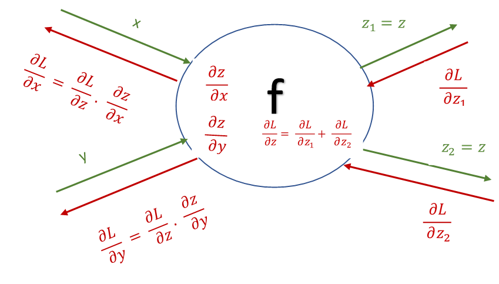
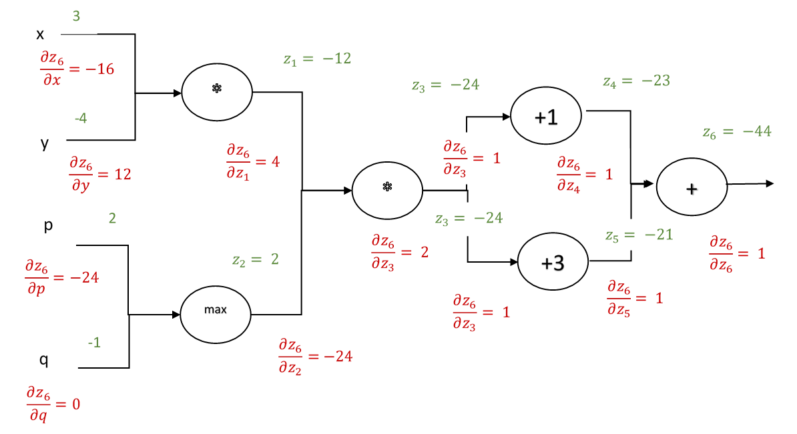

A computational graph is defined as a directed graph where the nodes correspond to mathematical operations. It is used as a way of expressing and evaluating a mathematical expression. Each node of a computational graph has one or two incoming edges carrying the inputs and one outgoing edge representing the result of the operation performed by the node on the inputs. There are two basic operations performed on a computational graph:  
**Forward Propagation:** Forward propagation involves computing the values of all nodes in the graph to arrive at the final value of the mathematical expression represented by the graph.  
**Back Propagation:** Back propagation involves calculating partial derivatives of the output of the graph w.r.t. the inputs of each node. These partial derivatives explain how the output of the graph varies w.r.t to its inputs  

## 1. Operations on Computational Graphs
Let *f* represent a mathematical operation represented by one of the nodes in a computational graph whose final output is L, such that  *z=f(x,y)* as depicted in the diagram below.  
* **Forward propagation** (shown in green) on a computational graph calculates the output  *L* of the graph by calculating the intermediate outputs  *z* of each node in the graph and passing on the output as input to the next node.  
* **Back propagation** (shown in red) calculates the gradient of L w.r.t. inputs of each node, passing the gradients thus calculated to nodes down the graph.    
	* The **input** to the back propagation operation at every node is the partial derivation of L w.r.t. the output of that node z i.e. $$\displaystyle \frac{\partial L}{\partial z} $$   
	* The **output** of backpropagation is the partial derivatives L w.r.t. to the inputs of the node i.e.  $$ \displaystyle \frac{\partial L}{\partial x}, \frac{\partial L}{\partial y} $$  

 
 
 
       

     

 
### 1.1. Back Propagation **Procedure**

The back propagation procedure involves the following steps performed on each node of the graph, starting at the result node:  

* If the output of a node is distributed to multiple nodes during forward propagation, the inputs from all of them during to backpropagation are added together i.e $$ \displaystyle \frac{\partial L}{\partial z}=  \frac{\partial L}{\partial z_1 } + \frac{\partial L}{\partial z_2} $$  
* Calculating the partial derivative of the output of the node z, w.r.t. inputs to the node x and y  i.e.  $$ \displaystyle \frac{\partial z}{\partial x} ,\frac{\partial z}{\partial y} $$  
* Calculating  $$ \displaystyle \frac{∂L}{∂x},\frac{∂L}{∂y} $$  using chain rule by multiplying the partial derivates calculated in the previous two steps i.e. $$ \displaystyle \frac{∂L}{∂x}=  \frac{∂L}{∂z}.\frac{∂z}{∂x} $$ and $$ \displaystyle \frac{∂L}{∂y}=\frac{∂L}{∂z}.\frac{∂z}{∂y} $$   

  
## 3. Example    

The computational graph below represents the following mathematical expression:  
  
$$ \displaystyle ((x*y) * max(p, q) +1 ) + ((x*y) * max(p, q) +3 ) $$  
  
It depicts the computation and the derivatives calculated during a pass of forward and back propagation on the graph  
 
 
 
 

     

 
	 
## 4. ADD, MAX and MUL Gates in Computational Graphs     

Observing forward propagation and back propagation in multiple computational graphs shows that the gradient propagation through the nodes in a computational graph follows a pattern:    
* **ADD** gate acts as gradient distributor. The gradient coming to a node from the nodes further in the computational graph are distributed as-is to the parent nodes during back propagation.    
* **MAX** gate acts as gradient router. The gradient coming to a node from the nodes further in the computational graph is sent to the parent node with the maximum incoming value during back propagation  
*  **MUL** gate acts as gradient scaler and switcher. The gradient coming to a node from the nodes further in the computational graph is scaled by the incoming value to the node from one branch and switched to the other during back propagation.    

## 5. Application of Computational Graphs to Learning in Neural Networks    

Neural networks are represented as computational graphs with each node of the graph containing a weight associated with each of its input. Learning in neural networks is performed by updating the weights in each node during back propagation such that the output of  the computational graph is as close as possible to expected output. To be more precise, during back propagation, at each node, not only the partial derivative of the output of the graph is calculated w.r.t.  each input but also w.r.t. weights corresponding to the inputs. Partial derivatives w.r.t. to the inputs to the nodes are propagated back to parent node while the partial derivatives w.r.t. to their weights are updated to minimize the difference between the actual output of the graph and expected output. The nature of update is dependent on the optimization algorithm being used and will be a topic of future posts.
