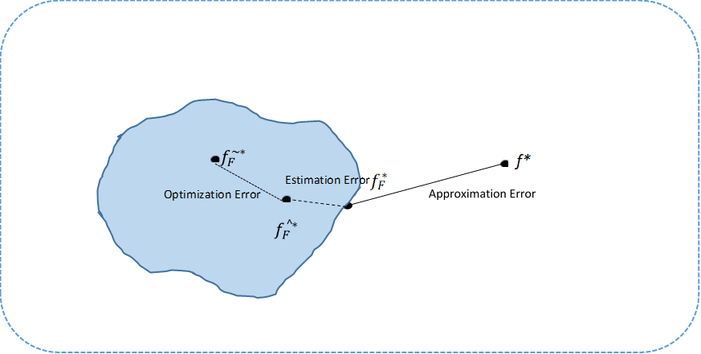

Supervised machine learning techniques are used to solve problems which cannot be framed as closed-form equations. These techniques aim to find a ***decision function*** that best fits data points consisting of inputs and the corresponding outputs generated empirically, called training data. The process involves:  
- Choosing candidate functions amongst which a decision function shall be chosen.
- Evaluating the candidate functions to choose a decision function amongst them which best fit the training data and also generalize well when evaluated against test data that is collected from the same I.I.D as the ***training data***.  

## Statistical Learning Theory Framework
To understand the criteria used to determine the size of the set containing candidate functions and to evaluate them we shall make use of statistical learning theory. It shall also help us understand the role played by optimization techniques in this process and how to choose the most appropriate ones for a given problem.  
Let us formally define decision function, its inputs, outputs and target:  
**Input-space:** The set of all possible inputs to a decision function represented as X  
**Action-space:** The set of all possible outputs of a decision function represented as A  
**Outcome-space:** The set of possible outcomes, also called labels or targets, that a decision function is trying to predict, represented as Y  
**Decision function:** A function that gets an input x є X and produces an action a є A is called a decision function, represented as:   
$$ \displaystyle f :	X \Rightarrow A $$  
  
To evaluate a decision function and compare it with others there needs to be a mechanism to quantify how far its outputs or actions are from the targets it is required to predict. With this objective in mind, the us define the following:   
  
 ***Loss function***:  A function that evaluates a single action a є A predicted by a decision function against the corresponding outcome y  є Y , represented as:
 $$ \displaystyle l( f(x),y) $$
   
***Risk***: The  expected loss  of a decision function *f* on a new example (x, y) drawn from a I.I.D. $$ \displaystyle  P_{X ,Y} $$ , represented as:    
$$ \displaystyle R(f)=E[ l( f(x),y)] $$
  
***Empirical Risk***: We do not know $$ \displaystyle P_{X ,Y} $$ to find the expected value of loss required to calculate its risk. To solve this problem we attempt to estimate the risk of a decision function that is trained on a dataset $$ \displaystyle D_n=( (x_(1,)  y_(1,) ),… ,(x_(n,)  y_(n,)  ))  $$ where (x,y) is sampled from  $$  \displaystyle P_{X ,Y} $$ .  Law of large numbers states that as the number of samRples taken from a distribution increases the average of the samples approaches the distribution mean or distribution expectation. Hence, we estimate the risk of the decision function as the average of loss for each data point. Such an estimation of the risk function is called *Emperical risk*.
 
$$ \displaystyle \hat{R}_n(f)= \frac{1}{n} \sum_1^n l( f(x),y) $$      
$$  \displaystyle lim_{n→\infty}⁡\hat{R}_n(f) = R(f) $$ 
   
***Empirical Risk Minimizer:***  The function that minimizes the emperical risk is called the *Emperical risk minimizer* and is defined as:   
 
$$  \displaystyle \hat{f}=arg⁡min⁡(\hat{R}_n(f)) $$   
  
***Bayes risk***:  Once the risk of a decision function is calculated, we need a benchmark against which it can be compared. Ideally, we might want to compare it against the function that achieves the minimal risk among all possible decision functions to solve the given machine learning problem. Such a function is called *Bayes decision function* and its corresponding risk is called *Bayes risk* represented as:  
$$  \displaystyle f^*=arg min(R(f)) $$ 
 
$$  \displaystyle R(f^*) $$  is called *Bayes risk*.
 
Note: It should be understood that there is practically no means to know the function $$ \displaystyle f^* $$ or its risk value as we do not know $$ \displaystyle P_{X ,Y} $$ 
  
***Constrained risk and Constrained risk minimser***: To limit the decision functions which we have to evaluate, domain of the set of decision functions is restricted to what is called *hypothesis space*, represented as *F*.  *F* is chosen to include function that are smooth, easier to work with (e.g. convex) and have better potential to generate good results on unseen data i.e. generalize.  Decision function in set *F* with the lowest risk is called *constrained risk minimizer*  
 
$$ \displaystyle R_F(f) = E[ l( f(x),y)] $$ 
  
$$  \displaystyle f^*=arg min(R_F(f)) $$ 
    
 ***Constrained Emperical Risk and Constrained Emperical Risk Minimser***: Same as in case of *Emperical Risk*, we do not know $$ \displaystyle P_{X ,Y} $$ to find the expected value of loss required to calculate i $$ \displaystyle R_F(f) $$. Therefore we, calculate *Constrained Emperical Risk and Constrained Emperical Risk Minimser* as follows: 
 
$$ \displaystyle \hat{R}_n(f) = \frac{1}{n} \sum_1^n l( f(x),y) s.t. f \in F $$   
$$  \displaystyle lim_{n→\infty}⁡\hat{R}_n(f) = \hat{R}_F(f)  $$  
 
$$ \displaystyle \hat{f}_F^* = argmin_{f є F}⁡\hat{R}(f) $$
 
It should be understood that a different dataset yields a different value of $$ \displaystyle \hat{f}_F $$ . The values are random as the dataset is considered random.   
  
## Excess Risk Decomposition   

Attempt to obtain constrained empirical risk minimizer involves use of various optimization techniques to minimize $$ \displaystyle R(\hat(f)_F) $$. However, optimization techniques do not succeed in finding $$ \displaystyle \hat(f)_F^* $$ but a function $$ \displaystyle \tilde(f)_F^* $$ that is sufficiently close to it ( For details see the next section ). Hence, best decision function that we can hope to find is  $$ \displaystyle \tilde(f)_F^* $$.  

The ***excess risk** of a decision function is defined as the difference of its risk with the risk of the decision function with least risk for that machine learning problem i.e :
$$ \displatstyle Excess Risk(f)=R(f)-R(f*) $$  
$$ \displatstyle Excess Risk(\tilde{f}_F* ) )= R(\tilde{f}_F^* )-R(f^*) $$    
$$ \displatstyle = R(\tilde{f}_F*)-R(f_F* )+ R(f_F* )-R(f*) $$  
$$  \displatstyle = R(\tilde{f}_F*) -R(\hat{f}_F*)            + R(\hat{f}_F^*)-R(f_F^* )               + R(f_F^* )-R(f^*) $$    
= Optimization Error      + Estimation Error      + Approximation Error      

     

 

If you make Hypothesis space larger approximation error tends to decrease as we might find a function within the hypothesis space whose risk function is closer to  R(f*). On the other hand, if you make Hypothesis space larger, keeping training data fixed,  Estimation Error tends to increase as there is a higher probability of overfitting a function whose risk is far away from risk of R(f_F^*)
The hypothesis space selection by a data scientist includes managing trade-off between increase in the estimation error due increased hypothesis space and decrease in approximation error. As we get more training data, we can increase the hypothesis space F without risk of overfitting.
Also, a data scientist needs to decide whether it is worth effort, resources and time to reduce optimization error beyond a point, since estimation and approximation errors often dominate the impact of optimization error to excess risk. Therefore most optimization learning techniques use only first order approximation instead of expending resources in second order approximation techniques, since second order approximation techniques are beneficial only when the initial point is already sufficiently close to \hat{f}_F*.  

