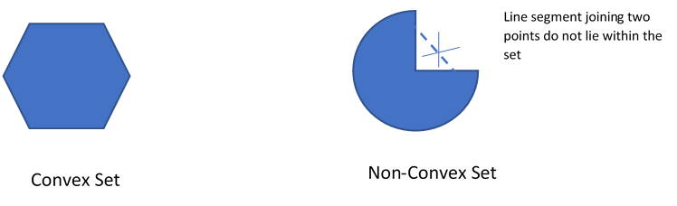
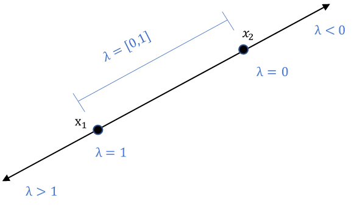
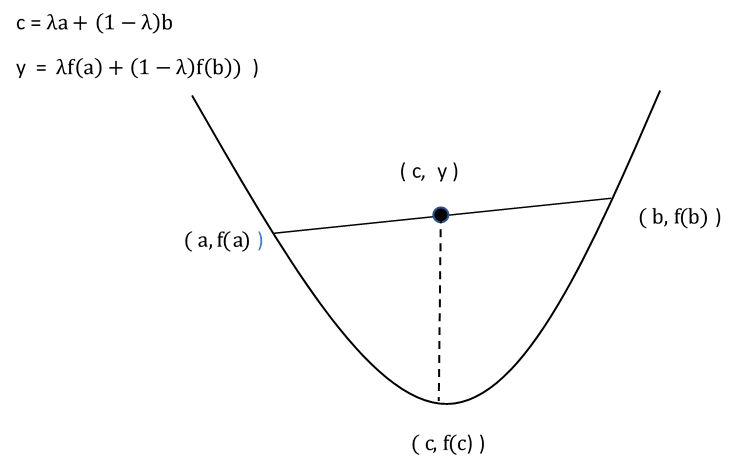
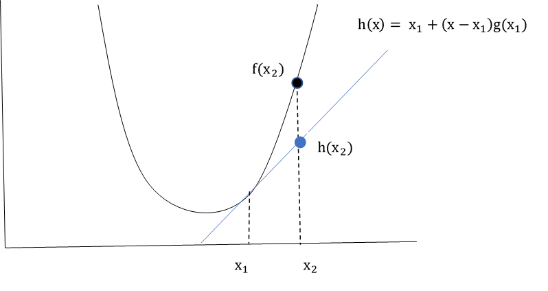

In the [previous](https://ritupande.github.io/Introduction-to-Statistical-Learning-Theory/) article, we discussed that we cannot evaluate all possible decision functions for a machine learning problem, due to time and processing constraints. Hence, we restrict the set of candidate functions to a set called hypothesis space.
Hypothesis space typically includes those functions that are easy to work with and optimize. One such class of functions is called *Convex Functions* and the task of finding the optimal value of such functions is termed as *Convex Programming Problem*.  More formally, 

If $$ C \subseteq R^n $$  is a nonempty convex set and $$ f: C \rightarrow R $$ be a convex function then a convex programming problem is defined as:  
  
 
**min** f(x)    
**s.t.** $$ x \in C $$ 
     
This article will answer questions like:  

- What are of Convex Sets ?  
- What are Convex functions ?  
- What does it mean if a Convex function is differentiable?  
- What are different flavors of Convex Programming Problem - based on the properties of the convex function being optimized and its use cases .
  

## 1. Convex Set

 A set is called *Convex* if for any two points in the set, the points on the line segment joining the two points lies entirely within the set.   

  

     
  

   
  
To enable us to define this more formally, let us see how a parameterized equation of a line passing through two points can be defined:

A line segment passing through two points $$ x_1, x_2 $$ with parameter $$ \lambda \in R $$  can be written as:    
$$ \lambda x_1 + (1-\lambda) x_2 $$    
  
The equations represents points on the line segment joining $$ x_1, x_2  $$  when $$ \lambda \in [0,1] $$ . For $$ \lambda $$  values negative or  greater than one, the equation represents the point  beyond the line segment joining  $$ x_1, x_2  $$  
  

     

 

This information allows us to formally define *Convex Set* as follows:   
A set  $$ C  \in  R^n $$  is called **convex set** if for any two points $$ x_1 $$ and $$ x_2 $$ in C and any scalar  $$ \lambda $$  s.t.  $$ \lambda \in [0,1] $$  :  
$$ \lambda + (1-\lambda ) x_2 \in  C $$    
  
### 1.1 Properties of Convex Set    
-	If $$ C_i $$ is a collection of convex sets, then $$ \displaystyle C_1 \cap C_2 \cap …\cap C_n $$ is a convex set  
-	If  $$ C_1, C_2 $$ are convex sets then $$ C_1 + C_2 $$ is a convex set  
-	If $$ C $$ is a convex set then $$ \alpha C $$ is also a convex set   
-	For a non-empty convex set C, there exists a unique point $$ x_o  \in C $$ which is at a minimum distance from $$ y \notin  C $$. Furthermore, $$ x_o $$ is a minimizing point iff:
  $$ (y-x_o) (x -x_o) < 0 $$  

## 2. Convex Functions  
If $$ C \subseteq R^n $$ is a convex set, then function  $$ f : C \rightarrow R $$ is said to be convex if for any $$ x_1, x_2  \in C $$ and  $$ \lambda \in [0,1] $$ :  
  
$$ f(\lambda x_1 + (1-\lambda) x_2 )  \leq \lambda f(x_1) + (1- \lambda ) f (x_2)  $$  
                             
This implies that any point, on the line segment joining two points on a convex function, lies above the value of the function at that point 

     

   

*Examples:*    
- 	$$ f(x) = a^T x + b $$ : This function is both convex and concave for $$ x \in R^n $$  
- 	$$ e^x , e ^{-x} $$:  This function is convex for $$ x \in R^n $$  
- 	$$ log( x ) $$: This function is convex for $$ x \in R^n : x > 0 $$ 
- 	$$ x^3 $$: This function is convex for $$ x \in R^n : x > 0 $$  
    
### 2.1 Level Set of Convex Functions  
Level set of a convex function f(x) is the set of all x for which the value of the function f(x) is below a specified value. More formally:  

If $$ C \subseteq R^n $$ is a nonempty convex set and $$ f: C \rightarrow R $$ be a convex function, then  level set of  the function **f**  for a given $$ \alpha $$ is defined as:  
$$ C_{\alpha} = { x \in C : f(x) \leq \alpha , \alpha \in  R } $$

### 2.2 Differential Convex Functions 
If $$ C \subseteq R^n $$ is a convex set and $$ f: \rightarrow R $$  is a differentiable function, then *f* is convex iff :    
$$ f(x_2)  \geq  f(x_1) + g(x_1)^T (x_2 – x_1 ) $$ where $$ x_1, x_2 \in C $$ and $$ g(x) = \nabla f(x) $$ 
  

     

   
As we see , $$ f(x_1) + g(x_1)^T (x – x_1 ) $$ is first order approximation of function *f* at $$ x_1 $$. The definition implies that first order approximation of a convex function never overestimates the function.  
  
This property of differential convex functions can be used to :
1. Find a crude lower bound of a convex function in a specifed interval.  
2. To understand how the gradient of a convex function changes w.r.t. its inputs

While point-1 is self-explanatory, point-2 might require some explanation:
  
Let $$ x_1, x_2 \in C s.t. x_2 \geq x_1 $$         
Using the above property of convex functions:  
  
$$ f(x_2)  \geq  f(x_1) + g(x_1)^T (x_2 – x_1 ) $$      
$$ f(x_1)  \geq  f(x_2) + g(x_2)^T (x_1 – x_2 ) $$      
  
The two equations can be combined to give:
  
$$  g(x_2)^T (x_2 – x_1 ) \geq f(x_2) - f(x_1)  \geq   g(x_1)^T (x_2 – x_1 ) $$ 
  
This implies :      
$$ g(x_2)  \geq g(x_1) $$ when $$ x_2 \geq x_1 $$ i.e. for a differentiable convex function  of one variable, the gradient is non-decreasing. The converse of the statement is also true.   
  
This property forms the basis of the most popular first-order optimization technique - *Gradient Descent* and its variants.
  
### 2.3 Operations that Preserve Convexity
-	If $$ f_1,f_2,…,f_k : R^n \rightarrow R $$ are convex functions, then $$ f(x) = \sum_{i=1}^k \alpha_i f_i(x)  $$ is also a convex function.
-	If $$ h:R \rightarrow R $$ and $$ f:R \rightarrow R $$   then $$ \psi(x) h(f(x)) is also convex if
h is convex and non-decreasing and f is convex or h is convex and non-increasing and f is concave.  
    
The above properties of convex functions can be used to form new convex functions from the ones that are known to be convex.
  
## 3. Convex Programming Problem

Now that we understand what convex sets and functions are, let us re-state the standard convex programming problem:  
  
If $$ C \subseteq R^n $$ is a nonempty convex set and $$ f: C \rightarrow R $$ be a convex function then a convex programming problem is defined as:
  
   
**min** f(x)    
**s.t.** $$ x \in C $$ 
   

Based on what we have seen till now, we can say that for any convex programming problem, the following properties hold good:    
-	Every local minimum of a convex function is a global minimum      
-	Set of all optimal solutions to a convex programming problem form a convex set.     
  
### 3.2 Constrained Convex Programming Problem

A standard convex programming can be modified to add inequality and/or equality constraints to it.   
  
If $$ C \subseteq R^n $$ is a nonempty convex set and $$ f: C \rightarrow R $$ be a convex function then a constrained convex programming problem is defined as:  
  
  
**min** f(x)  
**s.t.**  $$ h_i (x) \leq 0 $$  where h is a convex function and  i= 1 to m    
$$ e_j(x) = 0 $$  where $$ e(x) = a^T + b $$ and therefore convex and j = 1 to n    
  
  
As we know,  
  
-	the level set of convex functions are convex sets,    
-	Intersection of convex sets are also convex sets.  
  
Therefore, solutions to h(x) and e(x) i.e. the  constraints to the convex function f(x), are also convex sets  
  
### 3.3 Convex  Programming Problem for Differentiable Functions
If $$ C \subseteq R^n $$ is a nonempty convex set and $$ f: C \rightarrow R $$ be a differential convex function then the convex programming problem providing lower bound on the value of function **f** is defined as:  
  

**min** $$ f(x_o) + g(x)(x-x_o) $$  
**s.t.** $$ x, x_o \in C $$    

  
Note that the solution of the above function is not exactly the optimal value but only a lower bound in a specified interval.  
  
**Properties of differential convex functions:**  
-	If $$ f: C \rightarrow R $$ is a twice differentiable function on a convex set $$ C \subseteq R^n $$. Then f is convex iff its Hessian is positive semi-definite.    
-	First order condition $$ \nabla f (x)= 0 $$ is a sufficient condition for finding the minimum of the function and second order information is not required. This is because the hessian of a convex function is always positive semi-definite.  
 
## Summary
 Restricting the hypothesis set of decision functions of supervised machine learning problems to convex functions over convex sets allows for computationally efficient methods to find their optimal values. There is no fear of being stuck in a local optima as any local optima is also global optima of convex functions. Moreover, if the convex function is differentiable, its first order approximation can be used to find the lower bound of its optimal value within a specified interval. Also, it is guaranteed that the optimal value for a convex function shall lie at $$ \nabla f(x) = 0 $$ and no second order information is necessary. This is because Hessian of a convex function is always positive-semi-definite. All these properties of convex functions make them ideal to be chosen as candidate decision functions in hypothesis set of a machine learning problem.     

## References
1. [Numerical Optimization by Dr. Shirish K. Shevade, Department of Computer Science and Engineering, IISc Bangalore](http://www.nptelvideos.in/2012/11/numerical-optimization.html)
