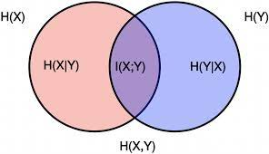

**Information theory**  is a subfield of mathematics that deals with the quantification of the information in events, random variables, and distributions and storing it in a fashion such that it is robust to errors ( channel encoding and error correction). The field was proposed and developed by Claude Shannon while working at the US telephone company Bell Labs to quantify information for communication. This post provides an introduction to basic concepts of information theory and their application to machine learning.  

## 1. Information
Information of an event can be intuitively understood as to how much surprise there is an event. Knowledge of an unlikely ( more uncertain ) event occurring is more informative  than learning that a likely event (more certain)  has occurred. This can be summarized as follows:  

Low Probability Event: High Information (surprising, more uncertain).  
High Probability Event: Low Information (unsurprising, more certain).

If an event has a probability of 0.25 i.e $$ \frac{1}{4} $$, it occurs only once in 4 possibile outcomes. Therefore, to communicate that such an event has occurred, information about which of the 4 possible outcomes has occurred has to be passed. This requires log2(4) = 2 bits of information to be trasnmitted.
    
For any event x, the information required to communicate its occurance in bits can be calculated as:    
$$ \displaystyle information(x) =  log_2( \frac{1}{p(x)} ) $$  
$$ information(x) =  -log_2(p(x)) $$    
  
### 1.1 Entropy
Calculating the information for a random variable is called information entropy. Entropy can be intuitively understood as the average or expected number of bits required to represent or transmit a random event drawn from the probability distribution for the random variable. For a discreet random variable X, which can take K possible values, with probability distribution p, information entropy can be represented as:  

$$ \displaystyle H(X) =  - \sum_1^K p(x) log_2(p(x)) $$ 

It should be noted that a skewed probability distribution has more certainity and less surprise and therefore low entropy. A uniformally distributed random variable has more uncertainity, hence potential for more suprise factor and therefore higher entropy.

### 1.2 Cross-Entropy
If P is a true distribution and Q an approximation of it, cross entropy can be intuitively understood as  average or expeceted number of bits required to represent an event in P using Q to encode it. More precisely,    
$$ \displaystyle H(P,Q) = - \sum_1^K p(x)log_2(q(x)) $$  
where p(x) is the probability of the event x in P and q(x) is the probability of the same event x in Q.  
  
###  1.3 KL-Divergence

KL- Divergence can be intuitively understood to be additional bits required to represent an event in true distribution, P by encoding it with its approximate distribution, Q instead of P itself.  
  
$$ D_{KL}(P \mid \mid Q ) =  H(P,Q) - H(P) $$

### 1.4 Conditional Entropy  
Conditional entropy quantifies the  amount of information or bits needed to describe the outcome of a random variable Y given that the value of another random variable X is known. If $$ H( X \mind Y ) = 0 $$, it means that outcome of X can be completely concluded if Y is known and there is no additional information required to be provided.
$$ H( X \mind Y ) = H(X ) $$ if X and Y are completely independent. Hence, even if outcome of Y is known, the number of bits required to represent the outcome of X is same as the entropy of X, had Y not been known.

$$ H(Y \mid X ) = E_X(H(Y \mid X=x) ) $$  
  
$$ = - \sum_{x \in X } p(x)* \sum_{y \in Y } p(y \mid x ) log_2( p(y \mid x ) $$  
   
$$ = - \sum_{x \in X } \sum_{y \in Y } p(x)*  p(y \mid x ) log_2( p(y \mid x ) $$   
  
$$ = - \sum_{x \in X } \sum_{y \in Y } p(x,y) log_2( p(y \mid x ) ) $$   
  

 
### 1.5. Information Gain
Information Gain measures the reduction in entropy or surprise by splitting a dataset according to a given value of a random variable.In this way, entropy can be used as a calculation of the purity of a dataset.  Information gain provides a way to use entropy to calculate how a change to the dataset impacts the purity of the dataset, e.g. the distribution of classes. A smaller entropy suggests more purity or less surprise. An entropy of 0 bits indicates a dataset contains only one class. One or more bits indicate how impure the dataset is. More impure the dataset, higher the entropy.  
  
if a dataset D, is divided into two groups $$ G_1 $$ and $$ G_2 $$ based on a variable a, the information gain can be written as: 
  
$$ IG(D, a) = H(D) - H(D \mid a ) $$  
  
$$ H(D \mid a ) can be calculated as follows:
$$ \displaystyle H(D \mid a )  = $$  \frac{count(G_1)}{count(D)} * H(G_1) + \frac{count(G_2)}{count(D)} * H(G_2) $$  
  
### 1.6 Mutual Information  
Mutual information is a measure the amount of information one can obtain from one random variable given another.The mutual information between two random variables X and Y can be stated formally as:  
$$ I (X; Y ) = H(X) – H(X \mid Y) = H(Y) -  H(Y \mid X) = I ( Y; X ) $$

     

 

### 1.7 Joint Entropy  
Joint entropy is the measure of total number of bits required to represent the simultaneous outcome of two randon variables and is represented as:
$$ H(X,Y) = H(X) + H(Y) - I(X;Y) $$  
  
## 2. Applications to Machine Learning

### 2.1 Cross-Entropy:Loss function for Classifiation Tasks 

In a supervised machine learning task, we attempt to learn parameters of a model, $$ \theta $$,  which given oberserved variable X , classifies it to unobserved variable  Y.
During training, both X and Y are provided to the model and the parameters are tuned against on objective function that maximizes maximize P(\theta \mid X,Y ).   

Using Baye's rule,  

$$ P(\theta \mid Y ) = \frac{P(Y \mid \theta ) P(\theta) }{ P(Y) }  $$
$$ P(\theta \mid Y ) \propto P(Y \mid \theta ) P(\theta) $$

Here p(\theta) is the *prior*. If we assume no prior information of the parameter $$ \theta $$ and assume the prior to be a uniform distribution over all C classes, the equation reduces to:  
$$ P(\theta \mid X ) \propto P(Y \mid \theta ) $$    
  
If $$ \hat{y} $$ is the output of the model that produces a probability distribution of input X belonging to one of the C classes:  
$$ P(\theta \mid Y ) \propto \prod_{i=1}^C P(\hat{y_i} \mid \theta_i ) $$  
  
The  objective function $$ L(Y,\theta) $$  of such a model, can be written as:     
$$ f(Y;\theta ) = \prod_{i=1}^C \hat{p}(y_i \mid \theta_i ) $$  
  
Taking log on both sides, the resulting log-likelihood function L, which when maximized, learns model parameters that predicts probability distribution that classifies the input observed variable(s) X to C different classes assumed  by the unobserved variable Y. The same effect can be achieved by minimizing the negative of the log-likelihood.    
$$ L(Y;\theta ) = - \sum_{i=1}^C  log(\hat{p}(y_i \mid \theta_i ) ) $$ 

Now, for a classification problem, the ground-truth value of Y is a one-hot encoded vector, with only a single element 1 ( corresponding to the true class) and remaining all elements 0. Also, input X to the model can belong to only one class which is found by calculating  $$ argmax(\hat{p}) $$ and corresponds to the elment whose corresponding value is 1 in the one-hot-encoding of the ground-truth. Hence,  L(Y;\theta ) is dependent only on $$ \hat{p}(y_i \mid \theta_i ) $$ where $$ y_i = 1 $$.  This can be achieved by modifying the above equation as:  

$$ L(Y;\theta ) = - \sum_{i=1}^C  y_i log(\hat{p}(y_i \mid \theta_i ) ) $$ 

If we look closely, this is nothing but the formula for cross-entropy between ground-truth distribution and predicted distribution of the model. This implies that for supervised clasification task, cross-entropy can be used as the loss or objective function. 
  
### 2.2 Information Gain: Decision Trees
Information Gain can be used as the split criteria in decision trees. Dataset is split using each variable in it at each level.  The variable split that results in the maximum information gain i.e. leave the resulting split datasets with least entropy, is chosen as the variable to split the tree at that level
  
### 2.3 Mutual Information: Feature Selection  
Fetaure selection is one area in machine learning where mutual information can be of help. Mutual information between each input varibale and the target variable can be calculated. Input variables with greater mutual information  carry more information about target variable within them than the variables with lower mutual information value. Mutual Information can therefore be used as a criteria for feature selection.  

### 2.3 Mutual Information: Graph Learning

- Mutual information can be used to model data as a graphical structure using mutual information to calculate the association between nodes in the graphical representation of the data. 
- It is also used in graph represenational learning to create node embeddings that maximizes the mutual information between the input node features and their embeddings. Refer [4] for details

## 3. References  
[1]. [What is Information Entropy](https://machinelearningmastery.com/what-is-information-entropy/)    
[2]. [Information Gain and Mutual Information for Machine Learning](https://machinelearningmastery.com/information-gain-and-mutual-information/)    
[3]. [Wikipedia-Mutual Information](https://en.wikipedia.org/wiki/Mutual_information)  
